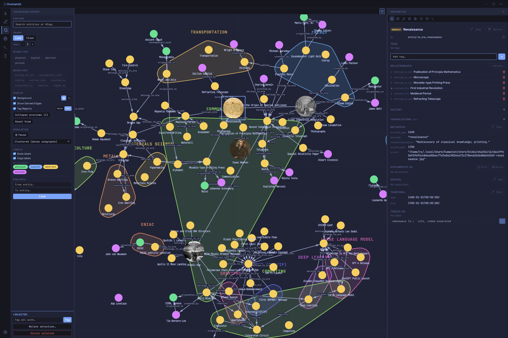
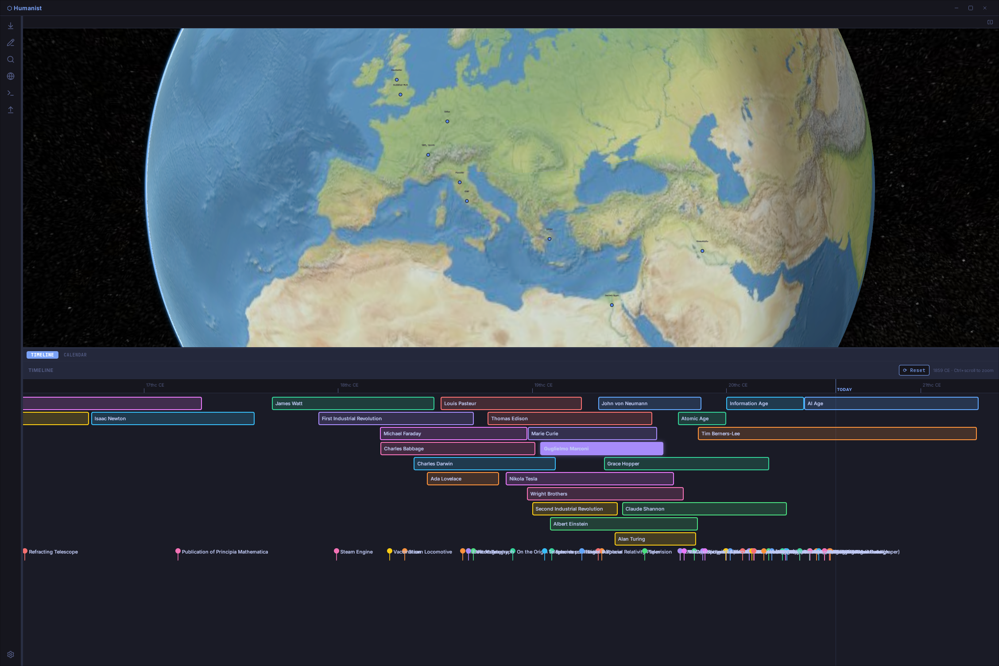

<p align="center">
  
</p>

<p align="center">
  <a href="https://github.com/mat-mgm/humanist/actions/workflows/ci.yml">
    
  </a>
  <a href="https://github.com/mat-mgm/humanist/releases/latest">
    
  </a>
</p>

# Humanist

<p align="center">
  
  
</p>

A local-first multimodal knowledge platform for managing entities, relationships, and spatial data through a unified graph interface, Prolog rules engine, and content-addressed blob store.

Developed as part of a master's thesis on knowledge representation and spatial operating systems.

---

## Overview

Humanist is a desktop application and headless CLI that treats all knowledge as a graph of typed entities connected by semantic edges. Nodes can carry spatial coordinates, temporal intervals, file attachments, and key-value metadata through composable traits rather than rigid schemas. A live-synchronised Scryer Prolog engine lets users author rules that derive new edges from existing facts; derived relationships can be persisted back into the graph.

The system is designed around three principles: local-first operation (no cloud dependency, embedded SurrealDB), symmetrical interfaces (every CLI command has a GUI equivalent), and a content-addressed blob store modelled after Git's object model.

---

## Acknowledgements

This project was developed as part of a master's thesis for the **Master's degree in Machine Learning and Cybersecurity for Internet Connected Systems**.

Supervised by **Cristian Rodriguez Rivero** and **Alireza Nik Aein Koupaei**.

---

## Architecture

The repository is a Cargo workspace structured with Hexagonal Architecture. External adapters (SurrealDB, Tauri IPC, Prolog runtime) are isolated behind trait ports; the core domain has no framework dependencies.

| Crate | Kind | Role |
|---|---|---|
| `core_engine` | library | Domain model, SurrealDB adapter, CAS blob store, Tokio event bus |
| `prolog_engine` | library | Scryer Prolog integration, canonical fact schema, snapshot I/O |
| `os_cli` | binary | Headless CLI built with Clap |
| `os_gui` | binary | Tauri 2 app with React/TypeScript frontend |

---

## Features

- **Graph workbench** — force-directed 2D graph with node/edge creation, edge reification (promote an edge to a node), per-type visual properties (flow direction, routing style, colour), and icon assignment
- **3D globe** — Cesium-based globe with causal timeline and calendar for temporal context tracking
- **Prolog rules engine** — author `.pl` rules stored as first-class entities; run inference live against the mirrored fact base; persist derived edges back to the database
- **Content-addressed blob store** — Git-style CAS with MIME-aware edition panel (CodeMirror for text/code, inline PDF, image, and GLB/GLTF preview)
- **Edition panel** — CodeMirror with syntax highlighting for Rust, Python, TypeScript, Markdown, YAML, JSON, HTML, CSS, and more; embedded PTY for `$EDITOR` sessions
- **Snapshot I/O** — export the full graph as a canonical `.pl` file plus `blobs/` directory; re-import deterministically
- **Terminal workbench** — multiplexed Shell, SurrealQL, and Prolog sessions via xterm
- **Tiling window manager** — opt-in DWM-style tiling layout (react-dnd) alongside the default VS Code-style activity bar layout
- **CLI parity** — every data operation (entity CRUD, edge management, tagging, snapshot export) is available headlessly via `os_cli`

---

## Getting Started

### Prerequisites

- [Nix](https://nixos.org/) with flakes enabled — all other dependencies (Rust 1.85, Node, Tauri tooling) are provided by the flake

### Development shell

```sh
nix develop
```

### Build

```sh
# Rust workspace (core_engine, prolog_engine, os_cli)
cargo build

# GUI (Tauri + Vite frontend)
cd os_gui && npm install
cargo tauri dev
```

### CLI

```sh
# Entity management
cargo run -p os_cli -- entity add physical "Main Server"
cargo run -p os_cli -- entity ls
cargo run -p os_cli -- entity search "Server"

# Relationships
cargo run -p os_cli -- edge add <FROM> <TO> --label "connected_to"

# Tagging
cargo run -p os_cli -- entity tag <ID> "critical"

# Snapshot export
cargo run -p os_cli -- snapshot export ./snapshot.pl
```

---

## Key Concepts

- **Entity categories** — `physical`, `digital`, `abstract`, `persona`; orthogonal to trait composition
- **Traits** — `SpatialTrait`, `TemporalTrait`, `BlobTrait`, `LabelTrait`, `KeyValueTrait`, `TableTrait`; any entity may carry any combination
- **Edges as first-class citizens** — tags are abstract entities connected via `tagged_as` edges, enabling graph traversal through tag hubs
- **Derived edges** — Prolog inference results rendered as dashed overlay edges; confirmable to permanent storage with `derived_from` provenance

---

## Evaluation & Benchmarks

The thesis evaluation suite lives on the [`eval/benchmarking`](../../tree/eval/benchmarking) branch. It adds a `benchmarks/` workspace crate with a headless benchmark binary (`humanist-bench`) and GUI-side instrumentation. Results are written to `docs/thesis/results/`.

```sh
git checkout eval/benchmarking
nix develop
```

### Dataset generation

All benchmarks operate on a deterministically generated dataset (seeded RNG, 600 entities, 700 edges):

```sh
cargo run -p benchmarks --release -- generate-dataset --seed 42
```

Scale up for the scaling sub-experiments (e.g. `--scale 4` = 2 400 entities):

```sh
cargo run -p benchmarks --release -- generate-dataset --scale 4
```

### Headless benchmarks

Run these from inside the Nix shell without the GUI:

```sh
# EventBus throughput (commit → broadcast latency)
cargo run -p benchmarks --release -- eventbus --trials 30 --warmup 3

# Prolog inference latency
cargo run -p benchmarks --release -- prolog --trials 30 --warmup 3

# Prolog scaling vs dataset size
cargo run -p benchmarks --release -- prolog-scaling --scales 1,4,10

# EventBus saturation (multiple subscribers)
cargo run -p benchmarks --release -- eventbus-saturation --subscribers 1,4,16,64

# Memory footprint (60 s observation window)
cargo run -p benchmarks --release -- memory --duration 60

# Analyse all collected results → JSON summaries
cargo run -p benchmarks --release -- analyze
```

### GUI benchmark (frontend sync latency)

The frontend sync benchmark requires the Tauri window. The included script handles dataset seeding, GUI launch, and result collection:

```sh
bash benchmarks/run_gui_benchmark.sh
```

The script prompts for manual steps inside the running GUI: arrange the three view planes (Globe, Timeline, Graph), then press `Ctrl+Shift+B` to start the suite (3 warm-up + 30 measured trials per plane). Results are saved to `docs/thesis/results/frontend_sync_lag.csv`.

---

## License

[GNU General Public License v3.0](LICENSE.md)
